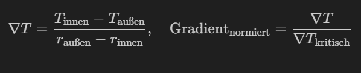
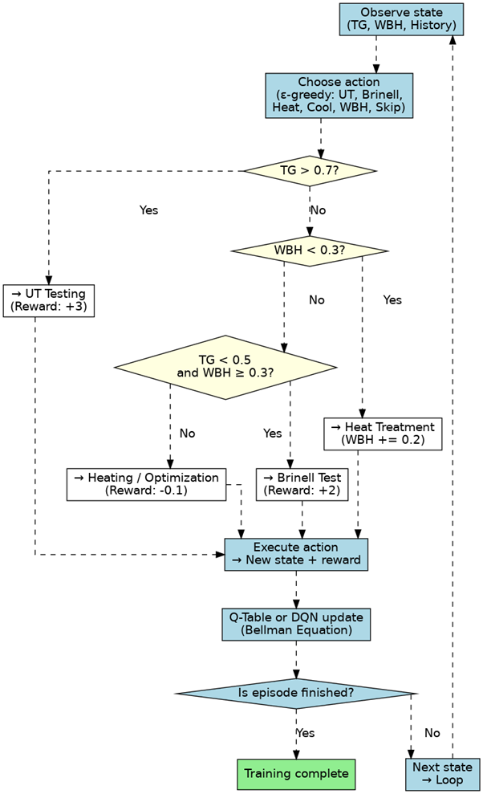
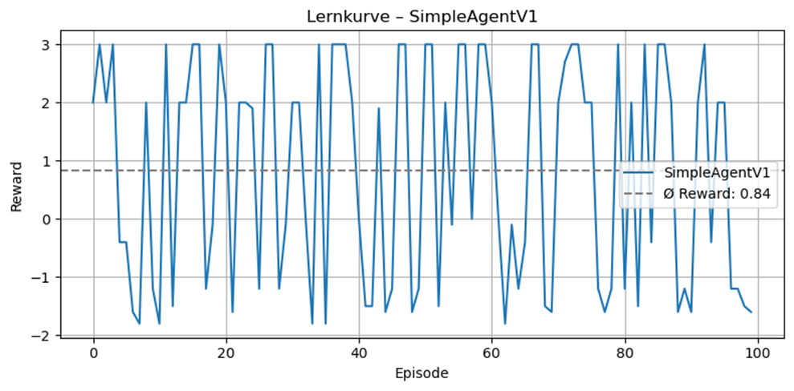
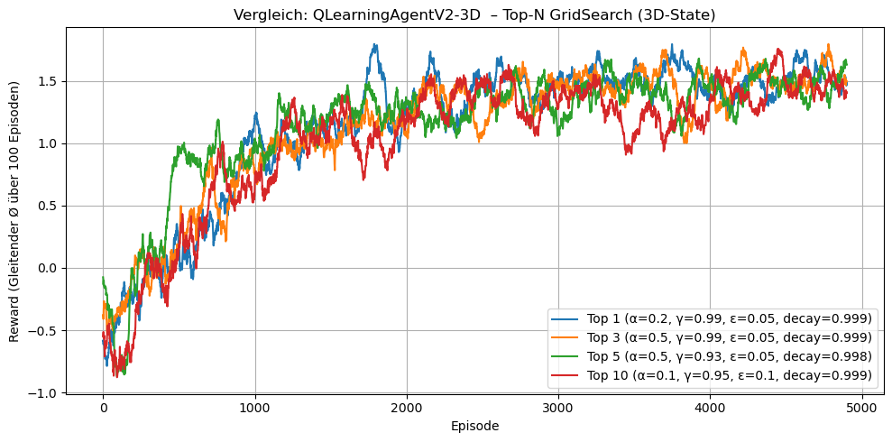
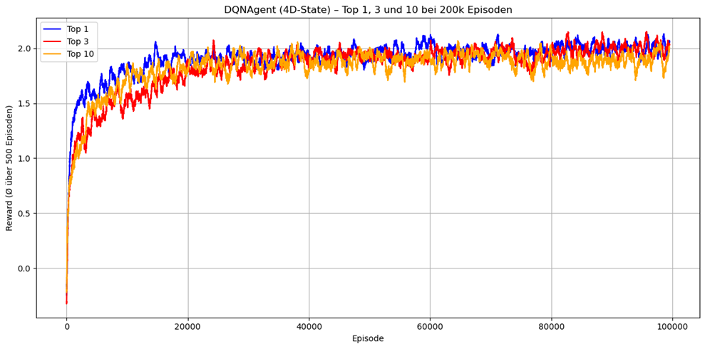

#  Reinforcement Learning basierte Prüfpfadentscheidung bei Offshore-Wälzlagern

## Projektziel:

### Der Reinforcement-Learning-Agent soll lernen, für ein Offshore-Großwälzlager auf Basis des aktuellen Zustands (Temperaturgradient, Wärmebehandlungsstatus, Aktionshistorie) eine geeignete Prüfstrategie auszuwählen. Dabei steht die Entscheidung im Fokus, ob:

- keine Prüfung (Skip),

- eine kostengünstige Brinell-Härteprüfung oder

- eine aufwendige Ultraschallprüfung (UT) erforderlich ist, und ob vorherige Zustandsveränderungen (z. B. Heizen, Wärmebehandlung) sinnvoll sind, um eine kosteneffizientere Prüfung zu ermöglichen.

##  Physikalischer Hintergrund

**Werkstoff:** 100Cr6 (1.3505), typischer Wälzlagerstahl  
**Härte nach Wärmebehandlung:** ~**700 HBW** (≈ 62 HRC, umgerechnet)  
**Einsatzbereich:** Offshore-Anwendungen mit **C5-M**-Korrosionsanforderung gemäß **ISO 12944**

###  Wichtige Werkstoffmerkmale:
- Hohe Härte und Verschleißfestigkeit nach Ölabschrecken und Anlassen
- Nicht korrosionsbeständig → **Chromgehalt < 13 %**
- Zusätzlicher **Korrosionsschutz erforderlich** (z. B. Zn/Ni-Beschichtung, Kapselung, Dichtungen)


###  Prüfmethoden im Vergleich

| Verfahren        | Zeitaufwand      | Eigenschaften                             | Typischer Einsatz                    |
|------------------|------------------|--------------------------------------------|--------------------------------------|
| **Brinell (HBW)**| ~**3 Minuten**    | mechanisch robust, flächige Eindrucksmessung | Standardkontrolle für gehärtete Oberflächen |
| **Ultraschall (UT1 + UT2)** | ~**30 Minuten** | fehlerortend, tiefenauflösend, teurer     | bei Verdacht auf innere Defekte oder Endkontrolle |

**Entscheidungskriterium:**  
Der Reinforcement-Learning-Agent soll **selbstständig lernen**, ob eine kostengünstige Brinell-Prüfung **ausreicht**, oder ob eine aufwendige Ultraschallprüfung **nötig ist** – je nach Zustand des Bauteils.


###  Thermische Gradientendynamik

**Temperaturverteilung innerhalb des Großwälzlagers** beeinflusst die Eigenspannungen und Prüfentscheidungen:

<p align="center">
  
</p>

###  Wärmebehandlungsverlauf

Umwandlungen wie Austenit → Martensit oder Bainit folgen temperaturabhängigen Reaktionsraten, modelliert durch die Arrhenius-Gleichung:

$$
k(T) = A \cdot \exp\left(-\frac{Q}{R \cdot T}\right)
$$

**Legende:**

- \(k(T)\): Reaktionsgeschwindigkeit  
- \(A\): präexponentieller Faktor  
- \(Q\): Aktivierungsenergie [J/mol]  
- \(R = 8,314~{J/mol·K}\): universelle Gaskonstante  
- \(T\): Temperatur in Kelvin


## Spielregeln

### Zustand

- temperaturgradient ∈ [0, 1]: simuliert ∇T normiert, kritisch ab ~0.7
- wärmebehandlungsgrad ∈ {0, 1}: 1 = korrekt durchgeführt, 0 = mangelhaft
- last_action, prev_action ∈ {0–5} (Index: [Skip, UT, Brinell, Heizen, Kühlen, Wärmebehandlung])


###  Aktionsübersicht & Rewards

| Index | Aktion                  | Effekt                                            | Reward (wenn erlaubt) | Reward (wenn nicht erlaubt)                      |
|-------|-------------------------|---------------------------------------------------|------------------------|--------------------------------------------------|
| 0     | Skip                    | Keine Prüfung, beendet Episode                   | 0                      | −5 (wenn ∇T > 0.7 oder WBH < 0.3)                |
| 1     | UT (Ultraschallprüfung) | beendet Episode                                  | +3                     | −1.5                                             |
| 2     | Brinell (Härteprüfung)  | beendet Episode                                  | +2 (wenn WBH ≥ 0.3)    | −1 (wenn WBH < 0.3)                              |
| 3     | Heizen                  | ∇T + 0.1, kein done                               | −0.1                   | —                                                |
| 4     | Kühlen                  | ∇T − 0.1, WBH − 0.1, kein done                    | −0.1                   | —                                                |
| 5     | Wärmebehandlung         | WBH + 0.2, kein done                              | −0.1                   | —                                                |


### Entscheidungslogik

- Wenn `temperaturgradient > 0.7` → **UT ist sicherer**  
  (hohe Eigenspannung → Brinell ungeeignet)

- Wenn `temperaturgradient < 0.5` **und** `wärmebehandlungsgrad ≥ 0.3` → **Brinell genügt**  
  (kosteneffiziente Variante, maximaler Reward)

- Wenn `wärmebehandlungsgrad < 0.3` → **Brinell nicht erlaubt**  
  → Agent kann:
  - entweder `UT` durchführen (sicher, aber teuer), **oder**
  - vorher `wärmebehandeln`, um `wärmebehandlungsgrad` auf ≥ 0.3 zu bringen und **dann Brinell**

- Aktionen wie `Heizen`, `Kühlen`, `Wärmebehandlung` dienen dazu, den Zustand gezielt in einen prüfbaren Bereich zu verschieben  
  (z. B. ∇T erhöhen für UT, Wärmebehandlung verbessern für Brinell)

- ⚠️ **Um zu verhindern, dass der Agent durch wiederholtes Heizen künstlich den UT-Zustand erzeugt, um konstant +3 zu kassieren,** wurde eine Regel eingeführt:
- **Maximal 2 Aktionen pro Episode**
- **Wiederholung derselben Aktion führt zu einer Strafbewertung von −1.0**


**Ziel des Agenten:**
- So **wenig UT wie nötig** (teuer, aber sicher)
- So **wenig Skip wie möglich** (Qualitätsrisiko)
- So **oft wie möglich Brinell**, **wenn Zustand es zulässt**
- **Zustandsveränderungen intelligent nutzen**, um günstige Prüfungen zu ermöglichen


 ###  <h3 align="center">Flowchart - Entscheidungslogik</h3>
 <p align="center">
  
</p>


### Beispielhafte Entscheidungslogik eines intelligenten Agents

####  **Szenario 1: Direkter Brinell-Check**
- Zustand: `temperaturgradient = 0.3`, `wärmebehandlungsgrad = 0.9`
- Aktion: `Brinell` (günstig, schnell)
- Reward: **+2**

 Entscheidung: Der Agent erkennt einen idealen Zustand und nutzt die **kostengünstige Brinell-Prüfung**.

---

####  **Szenario 2: Unsicherer Zustand → Zustand verbessern → Brinell**
- Anfangszustand: `temperaturgradient = 0.4`, `wärmebehandlungsgrad = 0.1`
- Aktionen: Brinell nicht erlaubt, da Wärmebehandlung die Mindestanforderung von 0.3 nicht erreicht
  1. `Wärmebehandlung` → `wärmebehandlungsgrad` steigt auf 0.3 → Reward: **−0.1**
  2. `Brinell` (nun erlaubt) → Reward **+2**

- Gesamt-Reward: **+1.9**

 Entscheidung: Der Agent investiert **einmalig Energie**, um einen Brinell-Prüfzustand herzustellen. **Günstiger als UT.**

---

####  **Szenario 3: Temperatur zu niedrig → Agent heizt → dann UT**
- Anfangszustand: `temperaturgradient = 0.4`, `wärmebehandlungsgrad = 0.8`
- Aktionen:
  1. `Heizen` → `temperaturgradient = 0.5` → Reward: **−0.1**
  2. `UT` → Reward: **+3**

- Gesamt-Reward: **+2.9**

##  Überblick der RL-Umgebungen (Environments)

### 🟡 `WzlPruefEnv2D` 
- Zustandsraum:
`temperaturgradient` (z. B. innen ↔ außen)
`wärmebehandlungsgrad` (Qualität des Wärmeprozesses)
- `state = (temperaturgradient, wärmebehandlungsgrad)`


- Ziel:
Lerne einfache Prüfentscheidungen basierend auf aktuellem Zustand.

- Typische Strategie:
→ „Wenn gradient hoch → UT; wenn Behandlung schlecht → Brinell“

- Einsatz:
Baseline-Agenten wie SimpleAgentV1, erstes Q-Learning (V1)


### 🟠 `WzlPruefEnv3D`
- Zusätzlicher Zustand:
last_action – Was wurde in der vorherigen Aktion gemacht?
- `state = (temperaturgradient, wärmebehandlungsgrad, last_action)`

- Ziel:
Modellieren von Verkettungen wie:
„Heizen → anschließend Brinell“ oder „Wärmebehandlung → UT“

- Warum wichtig?
Prüfpfade sind oft mehrstufig, nicht isolierte Einzelschritte.

- Einsatz:
QLearningAgentV2 (mit rudimentärem Entscheidungsverlauf)

### 🔵`WzlPruefEnv4D`
- Zusätzlicher Zustand:
prev_action – Zwei Aktionen zurück (wie ein kurzes Gedächtnis)
- `state = (temperaturgradient, wärmebehandlungsgrad, last_action, prev_action)`

- Ziel:
Rückkopplungseffekte, Prüfpfad-Optimierung über mehrere Schritte hinweg

- Herausforderung:
10×10×6×6 Zustände = 3600 Einträge → Q-Table stößt an Grenzen

- Einsatz:
 DQN – notwendig für tieferes Entscheidungsverständnis

##  Agentenentwicklung – Evolution der Strategien

###  SimpleAgentV1

- **Typ:** Regelbasierter Agent ohne Zustandsverfolgung  
- **Zustand:** `(Temperaturgradient, Wärmebehandlungsgrad)`  
- **Aktionen:** 6 (Skip, UT, Brinell, Heizen, Kühlen, Wärmebehandlung)  
- **Reward:** Ø ca. **0.84**
- **Erkenntnis:**  
  - Klare Entscheidungsregeln schlagen teilweise explorative Lernmethoden  
  - Diente als robuster Benchmark für spätere Agenten

  ###  <h3 align="center">Lernverlauf – SimpleAgentV1</h3>

<p align="center">
  
</p>


###  QLearningAgentV1 (2D)

- **Zustand:** `(Temperaturgradient, Wärmebehandlungsgrad)`  
- **Aktionen:** 6 (Skip, UT, Brinell, Heizen, Kühlen, Wärmebehandlung)  
- **Reward:** Ø bis **~1.43**  
- **Besonderheit:**  
  - Klassischer Q-Learning Agent mit tabellarischer Repräsentation  
  - Grid Search über α, γ, ε_min und decay  
  - Visualisierung der besten Kombinationen (Top 1–3–5–10) mit Moving Average

- **Erkenntnisse:**  
  - Grid Search zeigte starke Hyperparameterabhängigkeit  
  - Einfache Umgebung → schneller Lerneffekt

  ### <h3 align="center">Lernverlauf – QLearningAgentV1 (2D)</h3>

<p align="center">
  
</p>


###  QLearningAgentV2 (3D)

- **Zustand:** `(Temperaturgradient, wärmebehandlungsgrad, last_action)`  
- **Aktionen:** 6 (Skip, UT, Brinell, Heizen, Kühlen, Wärmebehandlung)  
- **Reward:** Ø bis **~1.55**  
- **Ziel:** Modellierung einfacher Sequenzen wie „Heizen → Brinell“  
- **Besonderheit:**  
  - Zustandserweiterung um letzte Aktion  
  - 600 mögliche Zustände

- **Erkenntnisse:**  
  - Verbesserte Leistung gegenüber QLearningAgentV1  
  - Historische Kontextinformation führt zu gezielteren Entscheidungen  
  - Erste Anzeichen steigender Komplexität → Performance stagniert ab gewissen Grenzen

  ### <h3 align="center">Lernverlauf – QLearningAgentV2 (3D)</h3>

<p align="center">
  
</p>

###  DQN (4D, mit neuronalen Netzen)

- **Zustand:** `(Temperaturgradient, wärmebehandlungsgrad, last_action, prev_action)`  
- **Aktionen:** 6 (Skip, UT, Brinell, Heizen, Kühlen, Wärmebehandlung)  
- **Reward:** Plateau bei **2.03**, auch nach 200k Episoden  
- **Besonderheit:**  
  - Deep Q-Network auf Basis von TensorFlow  
  - 3600 mögliche Zustände → tabellarisches Q-Learning nicht mehr sinnvoll   
  - Speichert Rewards automatisch in `.npy`-Dateien → resume-fähig

- **Erkenntnisse:**  
  - Klassisches Q-Learning skaliert schlecht in hohen Dimensionen  
  - DQN ermöglicht bessere Verallgemeinerung, aber Reward bleibt limitiert  
  - Hauptlimitierender Faktor: das physikalisch definierte Reward-System

  ### <h3 align="center">Lernverlauf – DQNAgent (4D) </h3> 
  <p align="center">
  
</p>


[def]: lots/SimpleAgentV1_.pn

##  Projekttechnik

- **Grid Search** über >50 Hyperparameterkombinationen (`α`, `γ`, `ε_min`, `decay`)
- **Automatische Zwischenspeicherung** aller Trainingskurven (`.npy`) für Reproduzierbarkeit
- **Logging**: Durchschnittlicher Reward alle 1000 Episoden zur Verlaufskontrolle
- **Visualisierung** der Top-N-Strategien mit:
  - **Moving Average** (Fenstergröße: 100)
  - **Farbkodierung** (Top 1–3: blau, rot, orange)
  - **Export** als `.csv` und `.png` für weitere Analyse
- **DQN-Modul** (Deep Q-Network) für Zustandsverarbeitung mit neuronalen Netzen
→ Anwendung von Replay Buffer, ε-greedy Policy, Target Network

###  Skalierung der RL-Umgebungen

Mit jeder Agentengeneration wurde gezielt die **Zustandsdimensionierung erhöht**:

- `2D`: Basiszustand  
  → `(Temperaturgradient, wärmebehandlungsgrad)`
- `3D`: zusätzlicher Kontext über letzte Aktion  
  → `(Temperaturgradient, wärmebehandlungsgrad, last_action)`
- `4D`: komplette Entscheidungsfolge über zwei Zeitschritte  
  → `(Temperaturgradient, wärmebehandlungsgrad, last_action, prev_action)`

 **Ziel**: Bewertung, wie weit klassische RL-Verfahren (Q-Table, DQN) mit wachsender Zustandskomplexität skalieren.


##  Verzeichnisstruktur

```plaintext
grosswaelzlager_pruef_rl/
├── README.ipynb                  ← Hauptdokumentation mit RL- und Werkstoffwissen
├── requirements.txt              ← Abhängigkeiten (pip install)
├── plots/                        ← Trainingskurven & Flowcharts
│   ├── DQNAgent_.png
│   ├── QLearningAgentV1_.png
│   ├── QLearningAgentV2_.png
│   ├── SimpleAgentV1_.png
│   └── rl_flowchart_.png
├── environments/                ← Simulationsumgebungen (2D, 3D, 4D)
│   ├── env_wzl_0.py             2D
│   ├── env_wzl_1.py             3D
│   └── env_wzl_2.py             4D
├── rl_agent/                    ← Verschiedene Agenten-Implementierungen
│   ├── agent_simple_v1.py
│   ├── DQNAgent.py
│   ├── q_learning_agent_V1.py
│   └── q_learning_agent_V2.py
├── notebooks/                   ← Auswertung und Visualisierung
│   └── agenten_plots.ipynb

```


##  Fazit & nächste Schritte

- Klassische **Q-Learning-Tabellen** reichen für einfache, klar strukturierte Prüfentscheidungen aus  
- In **hochdimensionalen Zustandsräumen**,  (z. B. `env_wzl_2 - 4D`) ist eine **Deep-Q-Network-Architektur (DQN)** notwendig  
- Die Kombination aus **Domänenwissen** (_z. B. Gradientformel, Werkstoffverhalten_) und datengetriebenem Lernen liefert robuste Prüfstrategien  
  Nach 200.000 Episoden erreichte er einen stabilen durchschnittlichen Reward von   **Ø 2.05**.
  

---

###  Industrie 4.0 – SAP-Anbindung (Optionaler Ausblick)

- Über ein SAP S/4HANA-System lassen sich produktionsnahe Parameter wie Wärmebehandlungsstatus, Prüfauftragsdaten oder Materialchargen automatisiert bereitstellen
- Das RL-Modell kann so auf **Live-Daten** reagieren und direkt in **Qualitätsentscheidungen** integriert werden (z. B. über das Modul **SAP QM** oder **SAP PP**)
- Einbindung über **OData- oder REST-API** wäre technisch realisierbar (z. B. via Python-Schnittstelle zu SAP Gateway)
- Produktionssysteme wie **MES** (Manufacturing Execution Systems) oder **BDE** (Betriebsdatenerfassung) könnten als praxisnahe Schnittstelle zur RL-Integration dienen.


**Vorteil:**  
Reale Produktionsdaten fließen in adaptive Prüfstrategien → vollautomatisiertes Prüfsystem mit Rückkopplung

---

**Nächster Schritt:**  
 Integration eines DQN mit Convolutional/Linear Layers zur **Generalisation über Zustandsräume hinweg**

**Langfristige Perspektive:**
- Einbindung von Sensordaten (z. B. reale Temperaturverläufe, Korrosionsraten)  
- SAP-Datenanbindung zur intelligenten Prüfsteuerung basierend auf Echtzeitdaten  
- Einsatz von Transfer Learning, um Wissen von einem Lagertyp auf andere Varianten zu übertragen


##  Kontakt & Profile


-  LinkedIn (https://www.linkedin.com/in/baris-enes)
-  GitHub: (https://github.com/baris-enes)

---

*Dieses Projekt wurde im Rahmen meiner Spezialisierung auf Reinforcement Learning für die industriellen Qualitätssicherung entwickelt – mit besonderem Fokus auf physikalisch fundierte Entscheidungsmodelle und SAP-nahe Produktionsdaten.*

